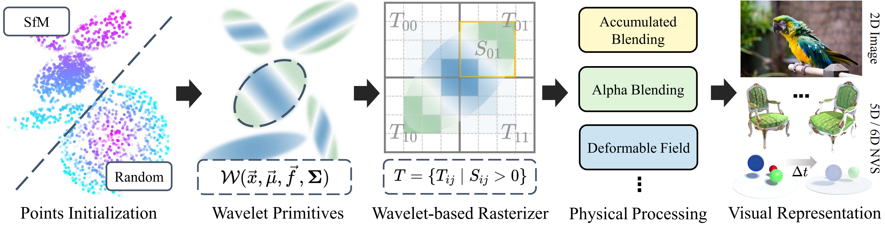

# WIPES: Wavelet-based Visual Primitives

## ICCV 2025

[Wenhao Zhang](https://github.com/MITNKU)<sup>1,\*</sup>,
[Hao Zhu](https://pakfa.github.io/zhuhao_photo.github.io/)<sup>1,\*</sup>,
[Delong Wu](https://ep1phany05.github.io/)<sup>1,\*</sup>,
[Di Kang](https://scholar.google.com/citations?user=2ztThPwAAAAJ&hl=zh-CN)<sup>2</sup>,
[Linchao Bao](https://linchaobao.github.io/)<sup>2</sup>,
[Xun Cao](https://cite.nju.edu.cn/People/Faculty/20190621/i5054.html)<sup>1</sup>,
[Zhan Ma](https://vision.nju.edu.cn/main.htm)<sup>1</sup>


<sup>1</sup>Nanjing University, <sup>2</sup>Tencent, <sup>\*</sup>Equal contibution

## [Project Page](https://mitnku.github.io/WIPES/) | [Paper](https://arxiv.org/abs/2508.12615)


We propose WIPES, a universal Wavelet-based vIsual PrimitivES for representing multi-dimensional visual signals. Building on the spatial-frequency localization advantages of wavelets, WIPES effectively captures both the low-frequency "🌴🌴forest🌴🌴"  and the high-frequency "trees.🌳"


This repository provides the code for several applications:

* **2D Image Fitting:** Demonstrates the model's ability to represent 2D images. Our Image fitting experiments are built upon the [**GaussianImage**](https://github.com/Xinjie-Q/GaussianImage) codebase
* **5D NVS:** Our Static NVS experiments are built upon the [**gaussian-splatting**](https://github.com/graphdeco-inria/gaussian-splatting) codebase.


<div align=center>

</div>

## Setup
### wipes_image
```bash
conda create -n wipes_image python=3.8
conda activate wipes_image
cd wipes_image
pip install -r requirements.txt
cd wipesplat
pip install .[dev]
```
### wipes_splatting
```bash
cd wipes_splatting
conda env create --file environment.yml
conda activate wipes_splatting
```

## Training

### Image Fitting
```bash
cd wipes_image
bash scripts/wipesimage_cholesky/toy_exp.sh.sh 

```

### 5D NVS

```bash
cd wipes_splatting
bash scripts/train_single.sh
```


## Citation
```BibTeX
@InProceedings{Zhang_2025_ICCV,
    author    = {Zhang, Wenhao and Zhu, Hao and Wu, Delong and Kang, Di and Bao, Linchao and Cao, Xun and Ma, Zhan},
    title     = {WIPES: Wavelet-based Visual Primitives},
    booktitle = {Proceedings of the IEEE/CVF International Conference on Computer Vision (ICCV)},
    month     = {October},
    year      = {2025},
    pages     = {27338-27347}
}
```